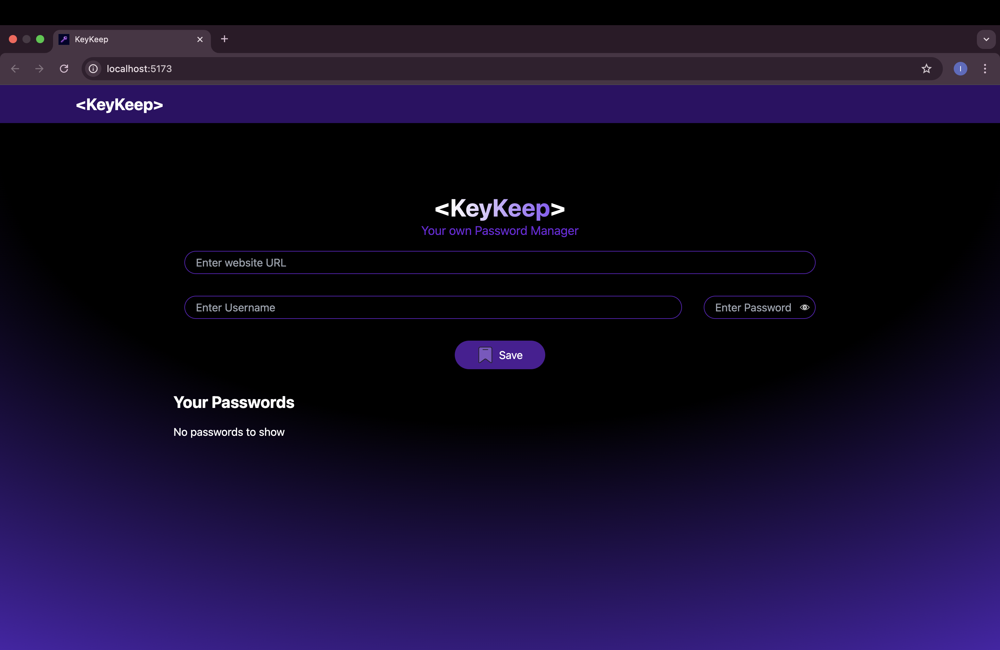
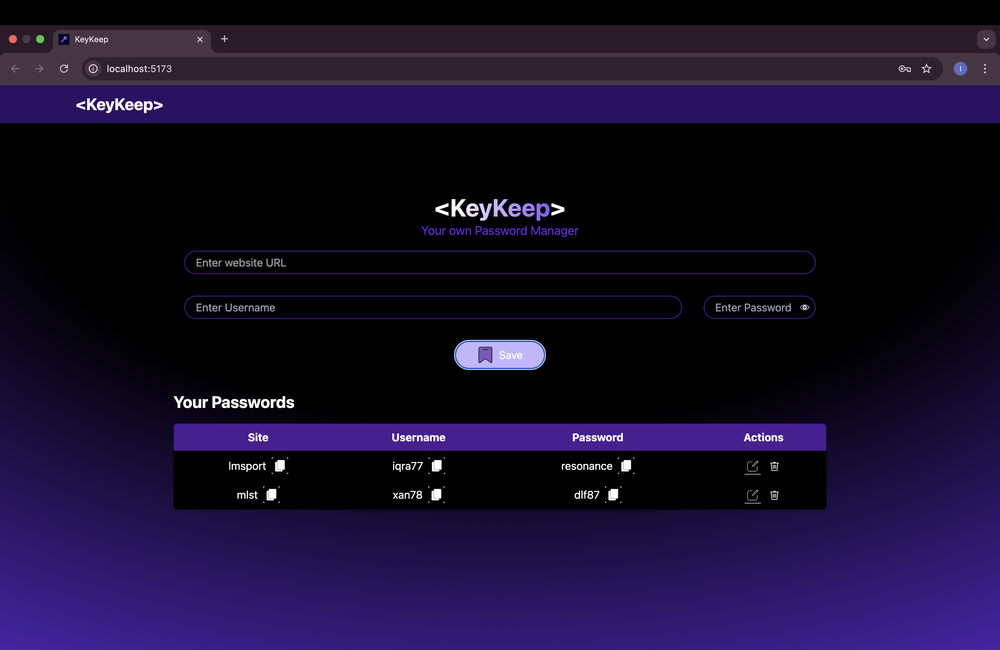

## KeyKeep

KeyKeep - a password manager built with React, MongoDB, Express and styled with Tailwind CSS. It allows users to safely store, retrieve, update, and delete passwords in an encrypted database through a responsive, user-friendly interface.

## Tech Stack

1. Frontend: React, Tailwind CSS
2. Backend: Node.js with Express.js
3. Database: MongoDB 

## 📸 Screenshots

### Screenshot 1

### Screenshot 2

